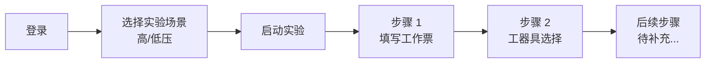

# 虚拟实验平台 (Virtual Experiment Platform)

基于 **Vue 3 + Spring Boot 4** 的虚拟实验教学平台，模拟用电信息采集终端安装与调试场景，支持学生在线完成高压 / 低压实验操作、教师管理实验、管理员系统管理。

---

## 技术栈

| 层级        | 技术                            | 版本      |
| ----------- | ------------------------------- | --------- |
| 前端框架    | Vue 3 + Vite                    | 3.5 / 8.0 |
| UI 组件库   | Element Plus                    | 2.14      |
| 路由        | Vue Router                      | 4.6       |
| 状态管理    | Pinia                           | 3.0       |
| HTTP 客户端 | Axios                           | 1.16      |
| 后端框架    | Spring Boot                     | 4.0       |
| ORM         | MyBatis-Plus                    | 3.5       |
| 数据库      | MySQL                           | 8.0       |
| 数据库迁移  | Flyway                          | —         |
| 身份认证    | JWT (jjwt)                      | 0.12      |
| 密码加密    | BCrypt (spring-security-crypto) | —         |
| 参数校验    | Jakarta Validation              | —         |

---

## 项目结构

```
virtual-experiment/
├── backend/                                 # 后端 Spring Boot 工程
│   ├── src/main/java/com/example/experiment/
│   │   ├── config/
│   │   │   ├── WebConfig.java               # CORS 跨域配置
│   │   │   └── DataInitializer.java         # 开发环境：自动插入实验模板
│   │   ├── controller/
│   │   │   ├── HelloController.java         # 健康检查 /api/hello
│   │   │   ├── AuthController.java          # 注册 / 登录接口
│   │   │   └── ExperimentController.java    # 实验启动 / 步骤提交接口
│   │   ├── service/
│   │   │   ├── UserService.java             # 用户服务接口
│   │   │   ├── ExperimentService.java       # 实验服务接口
│   │   │   └── impl/
│   │   │       ├── UserServiceImpl.java     # 用户服务实现（注册 / 登录）
│   │   │       └── ExperimentServiceImpl.java # 实验服务实现（启动 / 步骤提交）
│   │   ├── mapper/                          # MyBatis-Plus Mapper（8 张表）
│   │   ├── entity/                          # 数据库实体（8 张表）
│   │   │   ├── Users.java                   # 用户
│   │   │   ├── Organization.java            # 组织架构
│   │   │   ├── Roles.java                   # 角色
│   │   │   ├── UserRoles.java               # 用户角色关联
│   │   │   ├── ExperimentTemplates.java     # 实验模板
│   │   │   ├── ExperimentSteps.java         # 实验步骤
│   │   │   ├── UserExperiments.java         # 用户实验记录
│   │   │   └── UserExperimentSteps.java     # 用户实验步骤记录
│   │   ├── dto/                             # 数据传输对象（按域分包）
│   │   │   ├── auth/                        # 认证相关 DTO
│   │   │   │   ├── LoginDTO.java
│   │   │   │   ├── LoginVO.java
│   │   │   │   ├── RegisterDTO.java
│   │   │   │   └── UserVO.java
│   │   │   └── experiment/                  # 实验相关 DTO
│   │   │       ├── ExperimentStartDTO.java
│   │   │       ├── ExperimentStartVO.java
│   │   │       └── ExperimentStepSubmitDTO.java
│   │   ├── handler/
│   │   │   └── UUIDTypeHandler.java         # UUID ↔ BINARY(16) 类型转换
│   │   └── utils/
│   │       └── JwtUtils.java                # JWT 生成 / 解析
│   ├── src/main/resources/
│   │   ├── application.yml                  # 主配置（数据源 / Flyway / MyBatis）
│   │   ├── application.properties           # 数据源凭据
│   │   └── db/migration/                    # Flyway 数据库迁移
│   │       ├── V1__init_tables.sql           # 建表（8 张表）
│   │       ├── V2__create_data.sql           # 初始数据（组织 / 角色 / 用户）
│   │       └── V3__experiment_templates.sql  # 高压实验模板 + 步骤 1
│   └── pom.xml
│
├── frontend/                                # 前端 Vue 3 + Vite 工程
│   ├── src/
│   │   ├── api/
│   │   │   ├── auth.js                      # 登录 / 注册 API
│   │   │   └── experiment.js                # 实验 API（启动 / 步骤提交）
│   │   ├── assets/                          # 图片等静态资源
│   │   ├── components/
│   │   │   ├── LoginForm.vue                # 登录表单（Element Plus）
│   │   │   ├── RegisterForm.vue             # 注册表单（Element Plus）
│   │   │   ├── LeftPreview.vue              # 左侧装饰图片
│   │   │   ├── VerifyCode.vue               # Canvas 验证码组件
│   │   │   ├── ScenarioSelector.vue         # 高 / 低压场景选择
│   │   │   ├── HighVoltage/
│   │   │   │   ├── HWorkTicketForm.vue      # 高压工作票表单
│   │   │   │   └── HWizardInventorySelection.vue # 工器具选择向导
│   │   │   └── LowVoltage/                  # 低压场景组件（待完善）
│   │   ├── views/
│   │   │   ├── LoginView.vue                # 登录页
│   │   │   ├── RegisterView.vue             # 学生注册页
│   │   │   ├── ExperimentView.vue           # 学生实验页（场景选择 + 启动实验）
│   │   │   ├── AdminView.vue                # 管理后台页
│   │   │   ├── TestView.vue                 # 后端连通性测试页
│   │   │   ├── HighVoltage/
│   │   │   │   ├── HWorkTicket.vue          # 工作票填写步骤页
│   │   │   │   └── HToolSelectionView.vue   # 工器具选择步骤页
│   │   │   └── LowVoltage/                  # 低压场景页面（待完善）
│   │   ├── stores/
│   │   │   └── auth.js                      # 用户认证状态（Pinia）
│   │   ├── router/
│   │   │   └── index.js                     # 路由配置
│   │   ├── utils/
│   │   │   └── request.js                   # Axios 拦截器（JWT 注入 / 错误处理）
│   │   ├── App.vue
│   │   └── main.js
│   ├── vite.config.js                       # Vite 配置（含 /api 代理）
│   └── package.json
│
└── README.md
```

---

## 实验流程



### 已实现

| 步骤 | 页面路由 | 组件 | 说明 |
|------|---------|------|------|
| 场景选择 | `/experiment` | `ScenarioSelector` | 高 / 低压实验场景按钮 |
| 步骤 1 | `/HWT` | `HWorkTicketForm` | 填写工作票（手动校验） |
| 步骤 2 | `/WIS` | `HWizardInventorySelection` | 工器具选择向导 |

### 待完善

- 高压场景步骤 3-5（接线、调试、提交报告）
- 低压场景全部步骤
- 考试模式（当前仅支持训练模式）

---

## 快速开始

### 1. 数据库

```bash
mysql -u root -p -e "CREATE DATABASE virtual_experiment DEFAULT CHARSET utf8mb4 COLLATE utf8mb4_unicode_ci;"
```

启动后端后，Flyway 自动执行 `db/migration/` 下的 SQL 脚本（V1 → V2 → V3）。

### 2. 启动后端

```bash
cd backend

# Windows PowerShell
$env:MYSQL_PASSWORD="你的密码"

# Windows CMD
set MYSQL_PASSWORD=你的密码

# Linux / Mac
export MYSQL_PASSWORD=你的密码

# 启动
.\mvnw spring-boot:run
```

默认端口：`http://localhost:8080`

### 3. 启动前端

```bash
cd frontend
npm install
npm run dev
```

默认端口：`http://localhost:5173`（已配置 `/api` 代理到后端 8080）

---

## 测试账号

| 用户名     | 密码       | 角色    | 登录后跳转  |
| ---------- | ---------- | ------- | ----------- |
| `student1` | student123 | student | /experiment |
| `teacher1` | teacher123 | teacher | /admin      |
| `admin`    | admin123   | admin   | /admin      |

学生可通过注册页面自助注册，密码使用 BCrypt 加密存储。

---

## API 接口

### 认证

| 方法 | 路径                 | 说明                              | 认证 |
| ---- | -------------------- | --------------------------------- | ---- |
| POST | `/api/auth/register` | 学生注册（自动分配 student 角色） | 无   |
| POST | `/api/auth/login`    | 登录，返回 JWT + 角色 + 跳转路径  | 无   |

### 实验

| 方法 | 路径                       | 说明                              | 认证        |
| ---- | -------------------------- | --------------------------------- | ----------- |
| POST | `/api/experiment/start`    | 启动实验（传入 templateCode）     | Bearer JWT  |
| POST | `/api/experiment/step/submit` | 提交步骤结果（更新进度/评分）  | Bearer JWT  |

### 登录响应示例

```json
{
  "token": "eyJhbGciOiJIUzI1NiJ9...",
  "user": {
    "id": "74341904353443fcab03633f8cfebfa3",
    "username": "student1",
    "name": "学生A"
  },
  "roles": ["student"],
  "redirectUrl": "/experiment"
}
```

### 启动实验请求示例

```json
{
  "templateCode": "HV_TRAIN_V1"
}
```

### 启动实验响应示例

```json
{
  "experimentId": "abc123...",
  "templateName": "高压训练场景V1",
  "startTime": "2026-06-17T10:30:00",
  "steps": [
    { "stepId": "def456...", "stepName": "填写工作票", "stepOrder": 1 }
  ]
}
```

---

## 路由设计

| 路径          | 页面             | 访问权限          |
| ------------- | ---------------- | ----------------- |
| `/`           | 登录页           | 公开              |
| `/register`   | 学生注册页       | 公开              |
| `/experiment` | 实验场景选择页   | 登录即可          |
| `/admin`      | 管理后台         | 教师 / 管理员     |
| `/HWT`        | 工作票填写步骤   | 登录即可          |
| `/WIS`        | 工器具选择步骤   | 登录即可          |

---

## 数据库表

| 表名                    | 说明                                       |
| ----------------------- | ------------------------------------------ |
| `organization`          | 组织架构（树形：大学→学院→专业→年级→班级） |
| `users`                 | 用户（BCrypt 密码）                        |
| `roles`                 | 角色（admin / teacher / student）          |
| `user_roles`            | 用户角色关联                               |
| `experiment_templates`  | 实验模板                                   |
| `experiment_steps`      | 实验步骤                                   |
| `user_experiments`      | 用户实验记录                               |
| `user_experiment_steps` | 用户实验步骤记录（含操作统计 / 结果 JSON） |

---

## 设计说明

- **注册**：前端只开放学生注册，后端自动分配 `student` 角色
- **登录**：登录页不分角色，后端根据 `user_roles` 返回角色列表，前端据此跳转和渲染导航
- **密码**：BCrypt 加密存储，`UUIDTypeHandler` 不会误拦截 BCrypt 哈希（通过 hex 模式 + 16 字节长度双重校验）
- **UUID**：`BINARY(16)` 列通过全局 `UUIDTypeHandler` 自动与 Java `String`（32 位 hex）互转
- **DTO 按域分包**：`dto/auth/` 存放认证相关，`dto/experiment/` 存放实验相关
- **JWT**：登录签发 24h 有效 token，前端通过 Axios 拦截器自动注入 `Authorization: Bearer <token>`
