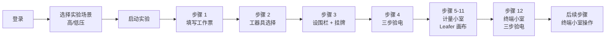

# 虚拟实验平台 (Virtual Experiment Platform)

基于 **Vue 3 + Spring Boot 4** 的虚拟实验教学平台，模拟用电信息采集终端安装与调试场景，支持学生在线完成高压 / 低压实验操作、教师管理实验、管理员系统管理。

---

## 技术栈

| 层级        | 技术                            | 版本      |
| ----------- | ------------------------------- | --------- |
| 前端框架    | Vue 3 + Vite                    | 3.5 / 8.0 |
| UI 组件库   | Element Plus                    | 2.14      |
| 路由        | Vue Router                      | 4.6       |
| 状态管理    | Pinia                           | 3.0       |
| HTTP 客户端 | Axios                           | 1.16      |
| 画布交互    | Leafer UI（计量小室画布）       | 2.x       |
| 后端框架    | Spring Boot                     | 4.0       |
| ORM         | MyBatis-Plus                    | 3.5       |
| 数据库      | MySQL                           | 8.0       |
| 身份认证    | JWT (jjwt)                      | 0.12      |
| 密码加密    | BCrypt (spring-security-crypto) | —         |
| 参数校验    | Jakarta Validation              | —         |

---

## 项目结构

```
virtual-experiment/
├── backend/                                 # 后端 Spring Boot 工程
│   ├── src/main/java/com/example/experiment/
│   │   ├── config/
│   │   │   ├── WebConfig.java               # CORS 跨域配置
│   │   ├── controller/
│   │   │   ├── AuthController.java          # 注册 / 登录接口
│   │   │   └── ExperimentController.java    # 实验启动 / 步骤提交 / 存档 / 恢复 / 步骤列表
│   │   ├── service/
│   │   │   ├── UserService.java             # 用户服务接口
│   │   │   ├── ExperimentService.java       # 实验服务接口（含存档）
│   │   │   └── impl/
│   │   │       ├── UserServiceImpl.java     # 用户服务实现（注册 / 登录）
│   │   │       └── ExperimentServiceImpl.java # 实验服务实现（启动 / 提交 / 存档 / 删除）
│   │   ├── mapper/                          # MyBatis-Plus Mapper（8 张表）
│   │   ├── entity/                          # 数据库实体（8 张表）
│   │   │   ├── Users.java                   # 用户
│   │   │   ├── Organization.java            # 组织架构
│   │   │   ├── Roles.java                   # 角色
│   │   │   ├── UserRoles.java               # 用户角色关联
│   │   │   ├── ExperimentTemplates.java     # 实验模板
│   │   │   ├── ExperimentSteps.java         # 实验步骤
│   │   │   ├── UserExperiments.java         # 用户实验记录
│   │   │   └── UserExperimentSteps.java     # 用户实验步骤记录
│   │   ├── dto/                             # 数据传输对象（按域分包）
│   │   │   ├── auth/                        # 认证相关 DTO
│   │   │   │   ├── LoginDTO.java
│   │   │   │   ├── LoginVO.java
│   │   │   │   ├── RegisterDTO.java
│   │   │   │   └── UserVO.java
│   │   │   └── experiment/                  # 实验相关 DTO
│   │   │       ├── ExperimentStartDTO.java
│   │   │       ├── ExperimentStartVO.java
│   │   │       ├── ExperimentStepSubmitDTO.java
│   │   │       └── UnfinishedExperimentVO.java
│   │   ├── handler/
│   │   │   └── UUIDTypeHandler.java         # UUID ↔ BINARY(16) 类型转换
│   │   └── utils/
│   │       └── JwtUtils.java                # JWT 生成 / 解析
│   ├── src/main/resources/
│   │   ├── application.yml                  # 主配置（数据源 / MyBatis）
│   │   └── application.properties           # 数据源凭据
│   ├── docs/sql/                            # 手动建库 SQL 脚本（按顺序执行）
│   │   ├── 01_init_tables.sql               # 建表（8 张表）
│   │   ├── 02_create_data.sql               # 初始数据（组织 / 角色 / 用户）
│   │   ├── 03_high_experiment_templates.sql # 高压实验模板 + 步骤
│   │   └── 04_low_experiment_templates.sql  # 低压实验模板 + 步骤
│   └── pom.xml
│
├── .github/
│   └── instructions/
│       └── project-conventions.instructions.md  # 项目开发规范
│
├── frontend/                                # 前端 Vue 3 + Vite 工程
│   ├── src/
│   │   ├── api/
│   │   │   ├── auth.js                      # 登录 / 注册 API
│   │   │   └── experiment.js                # 实验 API（启动 / 提交 / 存档 / 恢复 / 删除）
│   │   ├── assets/                          # 图片等静态资源
│   │   ├── components/
│   │   │   ├── LoginForm.vue                # 登录表单
│   │   │   ├── RegisterForm.vue             # 注册表单
│   │   │   ├── LeftPreview.vue              # 左侧装饰图片
│   │   │   ├── VerifyCode.vue               # Canvas 验证码组件
│   │   │   ├── ScenarioSelector.vue         # 高/低压场景选择
│   │   │   ├── PromptModal.vue              # 通用弹窗（确认按钮叠加）
│   │   │   ├── HighVoltage/
│   │   │   │   │   ├── HWorkTicketForm.vue      # 高压工作票表单
│   │   │   │   ├── HWizardInventorySelection.vue # 工器具选择向导
│   │   │   │   ├── HLeftToolBar.vue         # 左侧工具栏（围栏/告示牌）
│   │   │   │   ├── HRightToolBar.vue        # 右侧工具栏（终端/工器具/线材）
│   │   │   │   ├── HMiddleArea.vue          # 中间栏（步骤3/4/12 围栏+验电）
│   │   │   │   ├── HMeteringRoomCanvas.vue  # 计量小室 Leafer 画布（步骤5-11）
│   │   │   │   ├── HTerminalRoomCanvas.vue  # 终端小室 Leafer 画布（步骤13+）
│   │   │   │   └── HMeteringRoomGuide.vue     # 计量小室终端编号提示面板（画布上方悬浮）
│   │   │   └── LowVoltage/
│   │   │       └── LWorkTicketForm.vue      # 低压工作票表单
│   │   ├── views/
│   │   │   ├── LoginView.vue                # 登录页
│   │   │   ├── RegisterView.vue             # 学生注册页
│   │   │   ├── ExperimentView.vue           # 场景选择 + 启动实验 + 恢复
│   │   │   ├── AdminView.vue                # 管理后台页
│   │   │   ├── HighVoltage/
│   │   │   │   ├── HWorkTicketView.vue      # 工作票填写步骤页
│   │   │   │   ├── HToolSelectionView.vue   # 工器具选择步骤页
│   │   │   │   ├── HSceneOverviewView.vue   # 配电房全景图页
│   │   │   │   ├── HCabinetLocalView.vue    # 柜体局部操作页（步骤3-23 编排层）
│   │   │   └── LowVoltage/
│   │   │       └── LWorkTicketView.vue      # 低压工作票步骤页
│   │   ├── stores/
│   │   │   └── auth.js                      # 用户认证状态（Pinia）
│   │   ├── router/
│   │   │   └── index.js                     # 路由配置
│   │   ├── utils/
│   │   │   ├── request.js                   # Axios 拦截器（JWT 注入 / 错误处理）
│   │   │   └── time.js                      # 本地时间格式化工具
│   │   ├── constants/
│   │   │   ├── images.js                   # 图片资源集中管理
│   │   │   └── tool-selection-config.js     # 工器具选择配置
│   │   ├── App.vue
│   │   └── main.js
│   ├── vite.config.js                       # Vite 配置（含 /api 代理）
│   └── package.json
│
└── README.md
```

---

## 实验流程


```mermaid
flowchart LR
    A[登录] --> B[选择实验场景<br/>高/低压]
    B --> C[启动实验]
    C --> D[步骤 1<br/>填写工作票]
    D --> E[步骤 2<br/>工器具选择]
    E --> F[步骤 3<br/>设围栏 + 挂牌]
    F --> G[步骤 4<br/>三步验电]
    G --> H[步骤 5-11<br/>计量小室<br/>Leafer 画布]
    H --> I[步骤 12<br/>终端小室<br/>三步验电]
    I --> J[后续步骤<br/>终端小室操作]
```

### 已实现

| 步骤 | 页面路由 | 组件 | 说明 |
|------|---------|------|------|
| 场景选择 | `/experiment` | `ExperimentView` | 高/低压实验场景选择、未完成实验恢复 |
| 全景漫游 | `/HSO` | `HSceneOverviewView` | 配电房全景图、梯形热区定位、柜体入口 |
| 步骤 1 | `/HWT` | `HWorkTicketView` | 填写工作票（手动校验、存档/恢复） |
| 步骤 2 | `/HTS` | `HToolSelectionView` | 工器具选择向导（分页、选项卡、存档/恢复） |
| 步骤 3 | `/HCL` | `HCabinetLocalView` + `HMiddleArea` | 设围栏 + 挂告示牌（4 物品拖放） |
| 步骤 4 | `/HCL` | `HCabinetLocalView` + `HMiddleArea` | 三步验电（电源→柜体→电源） |
| 步骤 5 | `/HCL` | `HMeteringRoomCanvas` | 挂电表（点击跟随 + 热区放置 + 背景切换） |
| 步骤 6 | `/HCL` | `HMeteringRoomCanvas` | 接线盒开关调整（10 开关双坐标定位） |
| 步骤 7 | `/HCL` | `HMeteringRoomCanvas` | 接电压电流进出线（7 根导线，状态机 + Path 绘制） |
| 步骤 8 | `/HCL` | `HMeteringRoomCanvas` | 6芯信号线连接（两阶段接线 + 悬浮孔位信息） |
| 步骤 9 | `/HCL` | `HMeteringRoomCanvas` | 扎带标识牌放置（单步 + 背景切换） |
| 步骤 10 | `/HCL` | `HMeteringRoomCanvas` | 接线盒第二次调整 + 盖盖（Covered 背景） |
| 步骤 11 | `/HCL` | `HMeteringRoomCanvas` | 加铅封（5 处独立坐标/旋转）+ 确认键 |
| 步骤 12 | `/HCL` | `HCabinetLocalView` + `HMiddleArea` | 终端小室三步验电（第2步验电位置与步骤4 区分） |
| 步骤 13 | `/HCL` | `HTerminalRoomCanvas` | 终端小室画布框架（挂表等交互后续开发） |

### 已实现功能

- ✅ 用户注册/登录（JWT + BCrypt）
- ✅ 实验启动、步骤提交、进度存档、草稿恢复（含前序步骤数据补充）
- ✅ 未完成实验检测与恢复/删除
- ✅ 鼠标跟随物品拖放、命中检测（Vue HTML 层）
- ✅ 三步验电流程（电压检测笔交互，步骤 4 / 12 复用）
- ✅ 配电房全景图 + 梯形热区（CSS `clip-path`）
- ✅ 计量小室 Leafer 画布全流程（步骤 5-11：挂表 / 开关 / 接线 / 信号线 / 扎带 / 盖盖 / 铅封）
- ✅ 终端小室画布框架（`HTerminalRoomCanvas`，步骤 13+，尺寸与计量小室一致）
- ✅ 终端编号提示面板（16 列端子编号 + 485 接口连线，CSS 变量集中管理行尺寸、`cqw` 相对画布缩放）
- ✅ 画布热区可视化（蓝色半透明，坐标常量集中微调）
- ✅ 响应式布局（`vw`/`vh`/`%` 相对定位，画布 shrink-wrap 防缩放错位）
- ✅ 教学视频占位过渡、确认键（绿色浮动高亮动画）
- ✅ 操作统计（时长、操作次数、错误次数）与评分
- ✅ 线材图片统一命名（工具栏 1:1 与选择页 3:5 各保留一份，4mm² 由通用图放大模拟）

### 待完善

- 步骤 14-23（终端小室挂表、接线盒、信号线、通信模块等）
- 终端小室图片资源替换（当前共用计量小室图）
- 低压场景全部步骤
- 考试模式（当前仅支持训练模式）
- 教师管理后台功能
- 教学视频录制

---

## 快速开始

### 1. 数据库

```bash
mysql -u root -p -e "CREATE DATABASE virtual_experiment DEFAULT CHARSET utf8mb4 COLLATE utf8mb4_unicode_ci;"
```

数据库为**手动管理**：依次执行 `backend/docs/sql/` 下的脚本（01 → 02 → 03 → 04）。

### 2. 启动后端

```bash
cd backend

# Windows PowerShell
$env:MYSQL_PASSWORD="你的密码"

# Windows CMD
set MYSQL_PASSWORD=你的密码

# Linux / Mac
export MYSQL_PASSWORD=你的密码

# 启动
.\mvnw spring-boot:run
```

默认端口：`http://localhost:8080`

### 3. 启动前端

```bash
cd frontend
npm install
npm run dev
```

默认端口：`http://localhost:5173`（已配置 `/api` 代理到后端 8080）

---

## 测试账号

| 用户名     | 密码       | 角色    | 登录后跳转  |
| ---------- | ---------- | ------- | ----------- |
| `student1` | student123 | student | /experiment |
| `teacher1` | teacher123 | teacher | /admin      |
| `admin`    | admin123   | admin   | /admin      |

学生可通过注册页面自助注册，密码使用 BCrypt 加密存储。

---

## API 接口

### 认证

| 方法 | 路径                 | 说明                              | 认证 |
| ---- | -------------------- | --------------------------------- | ---- |
| POST | `/api/auth/register` | 学生注册（自动分配 student 角色） | 无   |
| POST | `/api/auth/login`    | 登录，返回 JWT + 角色 + 跳转路径  | 无   |

### 实验

| 方法   | 路径                          | 说明                   | 认证       |
| ------ | ----------------------------- | ---------------------- | ---------- |
| POST   | `/api/experiment/start`       | 启动实验               | Bearer JWT |
| POST   | `/api/experiment/step/submit` | 提交步骤结果（评分）   | Bearer JWT |
| POST   | `/api/experiment/step/draft`  | 保存进度草稿（不评分） | Bearer JWT |
| GET    | `/api/experiment/unfinished`  | 查询未完成实验         | Bearer JWT |
| GET    | `/api/experiment/step/draft`  | 恢复步骤草稿数据       | Bearer JWT |
| GET    | `/api/experiment/{id}/steps`  | 获取实验步骤列表（恢复时重建步骤映射） | Bearer JWT |
| DELETE | `/api/experiment/{id}`        | 删除未完成实验（级联） | Bearer JWT |

### 登录响应示例

```json
{
  "token": "eyJhbGciOiJIUzI1NiJ9...",
  "user": {
    "id": "74341904353443fcab03633f8cfebfa3",
    "username": "student1",
    "name": "学生A"
  },
  "roles": ["student"],
  "redirectUrl": "/experiment"
}
```

### 启动实验请求示例

```json
{
  "templateCode": "HV_TRAIN_V1"
}
```

### 启动实验响应示例

```json
{
  "experimentId": "abc123...",
  "templateName": "高压训练场景V1",
  "startTime": "2026-06-17T10:30:00",
  "steps": [
    { "stepId": "def456...", "stepName": "填写工作票", "stepOrder": 1 }
  ]
}
```

---

## 路由设计

| 路径          | 页面             | 访问权限          |
| ------------- | ---------------- | ----------------- |
| `/`           | 登录页           | 公开              |
| `/register`   | 学生注册页       | 公开              |
| `/experiment` | 实验场景选择页   | 登录即可          |
| `/admin`      | 管理后台         | 教师/管理员       |
| `/HSO`        | 高压配电房全景图 | 登录即可          |
| `/HWT`        | 高压工作票填写   | 登录即可          |
| `/HTS`        | 高压工器具选择   | 登录即可          |
| `/HCL`        | 柜体局部操作     | 登录即可（步骤3/4共用） |
| `/LWT`        | 低压工作票填写   | 登录即可          |

---

## 数据库表

| 表名                    | 说明                                       |
| ----------------------- | ------------------------------------------ |
| `organization`          | 组织架构（树形：大学→学院→专业→年级→班级） |
| `users`                 | 用户（BCrypt 密码）                        |
| `roles`                 | 角色（admin / teacher / student）          |
| `user_roles`            | 用户角色关联                               |
| `experiment_templates`  | 实验模板                                   |
| `experiment_steps`      | 实验步骤                                   |
| `user_experiments`      | 用户实验记录                               |
| `user_experiment_steps` | 用户实验步骤记录（含操作统计 / 结果 JSON） |

---

## 设计说明

- **注册**：前端只开放学生注册，后端自动分配 `student` 角色
- **登录**：登录页不分角色，后端根据 `user_roles` 返回角色列表，前端据此跳转和渲染导航
- **密码**：BCrypt 加密存储，`UUIDTypeHandler` 不会误拦截 BCrypt 哈希（通过 hex 模式 + 16 字节长度双重校验）
- **UUID**：`BINARY(16)` 列通过全局 `UUIDTypeHandler` 自动与 Java `String`（32 位 hex）互转
- **DTO 按域分包**：`dto/auth/` 存放认证相关，`dto/experiment/` 存放实验相关
- **实验存档**：支持保存进度草稿（全量表单数据），下次进入时询问是否继续
- **级联删除**：重新开始时仅删除未完成实验（status=0），已完成实验受保护
- **操作统计**：自动记录操作次数、错误次数、耗时，作为评分依据
- **评分机制**：满分 100 分，每错误一次扣 10 分，最低 0 分

---

## Leafer 开发要点（计量小室画布）

计量小室步骤（5-11）基于 **Leafer UI** 实现（`frontend/src/components/HighVoltage/HMeteringRoomCanvas.vue`），以下是沉淀的开发经验，供后续画布功能参考。

### API 用法（易踩坑）

| 要点 | 说明 |
| ---- | ---- |
| `PointerEvent.CLICK` | 事件常量在 `PointerEvent` 上，基础 `Event` 类没有 `CLICK` |
| `e.getLocalPoint()` | 取画布局部坐标（`getLocal()` 是 protected，构建产物不可用） |
| `leafer.resize({ width, height })` | resize 需传对象参数，不是 `(w, h)` |
| `hittable: false` | 元素不参与命中检测、不拦截点击（用于导线/跟随线等纯视觉元素；属性名是 `hittable` 不是 `hit`） |
| `zIndex` | 仅在同一父级内比较，跨 Group 不生效 |

### 画布对齐（防缩放错位）

- 容器 shrink-wrap 紧贴背景图实际渲染尺寸，Leafer 画布尺寸 = 背景图渲染尺寸
- 热区坐标统一用**背景图坐标（画布比率）**，窗口缩放时画布整体等比变化，热区相对位置不变
- 图片不压缩比例：宽固定、高按图片真实宽高比 auto（运行时加载 `naturalWidth/naturalHeight`，兜底常量 + `onerror`）

### 分层与热区

- 两层结构：`bgLayer`（背景图，按步骤切换）+ `hitLayer`（接线盒/开关/热区/导线）
- 层级顺序用 zIndex：背景 0 < 接线盒 1 < 开关/信号线 2 < 热区 3 < 导线 4
- 热区用**蓝色半透明填充**可视化，坐标集中为常量（如 `DROP_ZONE`/`SEALS`），由用户按背景图微调后移除

### 生命周期与重建

- 同组件导航（`/HCL?stepOrder=N`）不重新挂载 → `watch(stepOrder)` 处理步骤切换（构建/销毁对应热区）
- 图片比例异步加载：**先按兜底比例构建，比例就绪后校正并重建**（保留状态），避免元素不可见
- `onResize` 重建：`hitLayer.removeAll()` 后需清空所有引用数组并重建（含已放置的图片/导线重绘）
- 步骤完成销毁的资源（信号线、接线盒等）用状态守卫（如 `cableDone`）防止重建

### 草稿恢复（回档）要点

- `getDraftState()` 返回全部状态（数组需**归一化为定长**，稀疏数组 JSON 序列化后长度不一致会导致恢复条件失败）
- `restoreDraft` 判断画布就绪用 `leafer` 是否存在即可，**不要依赖 `junctionBoxRect.w > 0`**（步骤 11 无接线盒时恒为 0）
- pendingDraft 在 `createCanvas` 末尾统一应用（不要只挂在 ensureSwitches 上，步骤 11 不构建接线盒时会丢失）
- 恢复已放置元素（铅封/导线）后需**重建未放置位置的热区**（buildXxx 内部跳过已放置）
- 前序步骤结果（如步骤 7 导线）可能因 HMR 丢失 → 恢复时从**前序步骤记录补充**（getStepDraft 前一步 stepId）
- 背景按步骤推断（`bgForStep`：6-8 WithMeter、9 Wired、10 WithCableTies、11+ Covered），不依赖草稿

### 交互模式

- 鼠标跟随用 **Vue HTML 层**（`meter-following` 固定定位跟随），不进画布
- 导线/芯线跟随用画布内**动态 Path**（起点固定孔位、终点随鼠标，`PointerEvent.MOVE` 更新 path）
- 双色导线（红黑/黄黑）用**两条半宽线并排**模拟（法向偏移）
- 悬浮信息（孔位编号）用画布级 MOVE 遍历热区包含判断 → Vue 层 tooltip 显示在热区上方

### 覆盖层组件（画布上方悬浮面板）

计量小室终端编号提示面板（`HMeteringRoomGuide.vue`）沉淀的经验（终端小室提示面板后续开发可复用）：

- **定位**：覆盖层放在画布组件内（`canvas-stage` 内 `absolute` + 百分比 `left/width/bottom: 100%`），相对画布自动跟随缩放，无需 JS 计算视口位置
- **容器查询单位（cqw）**：覆盖层设 `container-type: inline-size`，内部全部用 `cqw`（容器宽 1%）——画布缩放时内部元素等比变化，与画布统一
- **行尺寸集中管理**：每行高度/字号定义为 CSS 变量（`--tg-top-h` 等），面板高度由各行求和自动撑开 → 长宽比例自然固定，改变量即调比例
- **SVG 连线**：485 接口连线用独立 SVG（viewBox 1000×60）绝对定位覆盖在 grid 之上（不占网格行），竖线起点对齐端子框底部；`overflow: visible` 允许超出显示
