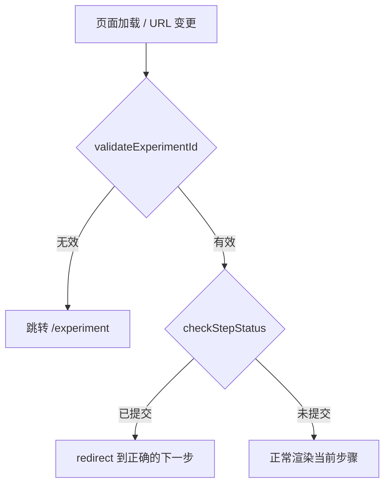

# URL 篡改防护设计

> 状态：设计待实施（对应待办事项第 7 条）

## 一、攻击面分析

```
/HCL?experimentId=X&stepId=S3&stepOrder=3
                               ↑ 可手动改为 4、99、空...
/HCL?experimentId=别人的ID     ↑ 可越权访问
/HCL                           ↑ 缺少全部参数
```

## 二、三层防护设计



## 三、前端 — 步骤页加载守卫

在 `onMounted` 中新增一个验证函数，所有步骤页共用：

```
验证流程:
1. experimentId 是否存在且格式合法
2. GET /experiment/{id}/unfinished 确认该实验属于当前用户且未完成
3. GET /experiment/step/draft?experimentId&stepId
   → 后端新增返回 status 字段，判断步骤是否已提交
4. 如果 stepOrder 与后端返回的实际 nextStepOrder 不一致 → replace 纠正
```

## 四、后端 — 新增步骤状态查询

在 `getStepDraftData` 返回值中加上 `status`：

```java
// ExperimentServiceImpl.java — getStepDraftData 改返回 Map
var result = new HashMap<String, Object>();
result.put("status", step.getStatus());   // 步骤是否已提交
// 草稿内容来自 user_experiments.draft_data（result_data 列已删除，见 05 迁移脚本）
if (experiment.getDraftData() != null) {
    result.putAll(new ObjectMapper().readValue(experiment.getDraftData(), Map.class));
}
return result;
```

这样前端就能知道「这个步骤是否已提交」。

> 字段说明：`user_experiment_steps.result_data` 已删除，草稿改存 `user_experiments.draft_data`。

## 五、共用 composable — `useExperimentGuard.js`

```
composables/
└── useExperimentGuard.js    ← 新增，所有步骤页复用
     │
     ├── 输入: experimentId, stepId
     ├── 验证:
     │   ├── 有效性检查
     │   ├── 步骤状态查询
     │   └── 与 sessionStorage 中的 steps 对比
     │
     └── 输出: { isValid, actualStepOrder, redirect }
```

## 六、修改清单

| 层   | 文件                                     | 改动                                     |
| ---- | ---------------------------------------- | ---------------------------------------- |
| 后端 | `ExperimentServiceImpl.getStepDraftData` | 返回 Map 中加入 `status` 字段            |
| 前端 | `composables/useExperimentGuard.js`      | 新增，步骤验证逻辑                       |
| 前端 | 4 个步骤页的 `onMounted`                 | 调用 `useExperimentGuard`，按需 redirect |

## 七、篡改场景处理

| 篡改方式                              | 行为                                                           |
| ------------------------------------- | -------------------------------------------------------------- |
| `stepOrder=4` 改为 `3`（步骤3已提交） | 检测到 step 3 status=1 → replace 回 step 4                     |
| `stepOrder=99`                        | 无效值 → replace 到当前实际步骤                                |
| `experimentId` 改为他人 ID            | 后端返回 403 或空数据 → 跳转 /experiment                       |
| 移除 stepId                           | `currentStepOrder` 兜底为 3，后端查不到记录 → 跳转 /experiment |
| stepOrder 与实际 nextStepOrder 不一致 | 以后端 nextStepOrder 为准，前端自动纠正                        |
